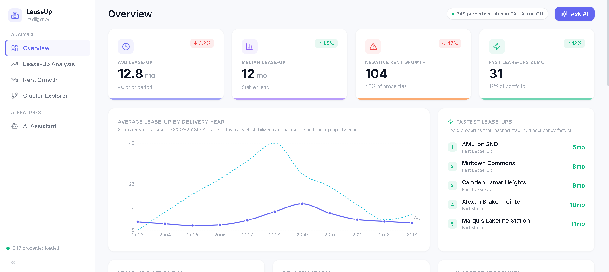
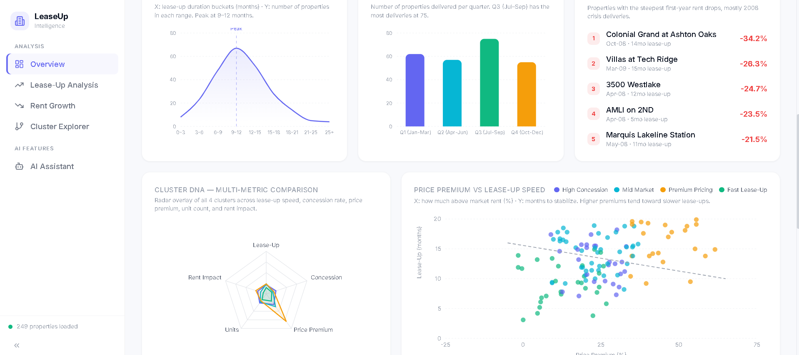
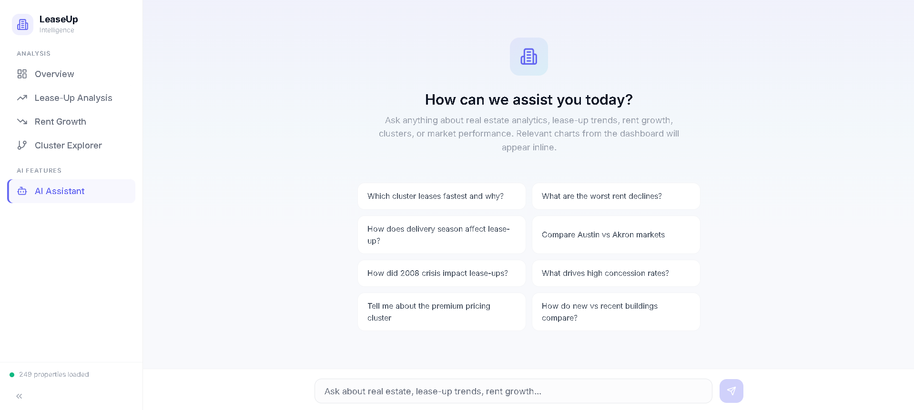
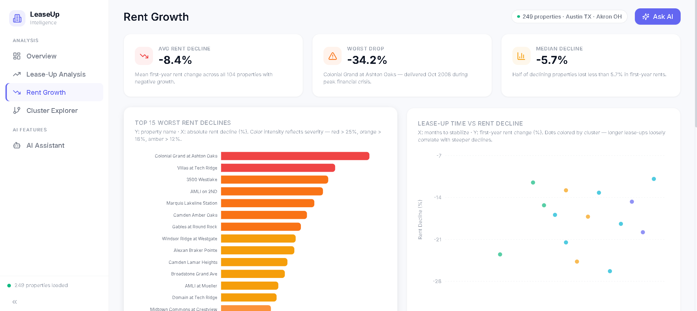

# LeaseUp Intelligence

This is a full-stack analytics project that combines Python-based data analysis with an interactive React dashboard. The goal is to explore how quickly multifamily apartment properties fill up with tenants (called "lease-up") across two US markets: Austin-Round Rock TX and Akron OH.

The project has two parts:
- **Task 1**: A Python notebook where the raw Excel data is cleaned, analyzed, and clustered to find patterns in lease-up speed, rent performance, and property behavior.
- **Task 2**: A React web dashboard that takes the findings from Task 1 and presents them as interactive charts, tables, and an AI-powered chat assistant that can answer questions about the data.

The dataset covers 249 properties with monthly data from April 2008 to September 2020.

## Screenshots

### Overview Dashboard




### AI Assistant


### Rent Growth Analysis


---

## Table of Contents

- [Screenshots](#screenshots)
- [Live Demo](#live-demo)
- [Tech Stack](#tech-stack)
- [Task 1 - Data Analysis (Python)](#task-1---data-analysis-python)
- [Task 2 - Interactive Dashboard (React)](#task-2---interactive-dashboard-react)
- [AI Architecture and Prompt Engineering](#ai-architecture-and-prompt-engineering)
- [Project Structure](#project-structure)
- [Getting Started](#getting-started)
- [Environment Variables](#environment-variables)
- [GenAI Usage Disclosure](#genai-usage-disclosure)

---

## Live Demo

> _Add your deployed URL here after hosting._

---

## Tech Stack

| Layer | Technology |
|-------|-----------|
| Data Analysis | Python, Pandas, NumPy, Scikit-learn, Sentence-Transformers, UMAP, Plotly |
| Frontend | React 18, Vite 6, Tailwind CSS 3 |
| Charts | Recharts |
| Icons | Lucide React |
| Animations | Framer Motion, CSS Transitions |
| AI | OpenRouter API (MiniMax M2.5) |
| Streaming | Server-Sent Events (SSE) via ReadableStream |

---

## Task 1 - Data Analysis (Python)

**Notebook**: `MSA_Analysis.ipynb`

The analysis begins with two raw Excel files (MSA1 and MSA2). Each file represents a different US metro area and contains four sheets of monthly time-series data: rent figures, occupancy and concession percentages, asset class grades, and property status codes. The data spans from April 2008 to September 2020.

### 1.1 - Delivered Properties Since April 2008

The first step was to filter the dataset down to only properties that were genuinely new to the market. This was done by looking for properties whose first recorded status was "Lease-Up" (LU) or "Under Construction / Lease-Up" (UC/LU), which means they were brand new buildings starting to find tenants.

After filtering, Austin had 247 qualifying properties while Akron had only 2. Austin also showed noticeable delivery spikes in 2014 and 2019, which likely reflect periods of stronger development activity in that market.

### 1.2 - Average Lease-Up Time

Lease-up time was measured as the number of months it took a property to go from its first "Lease-Up" status to reaching 90% occupancy (which is considered "stabilized" in the industry).

Austin properties took an average of 12.9 months to stabilize. The distribution was right-skewed, meaning most properties leased up in roughly a year, but a smaller number of slower performers took much longer and pulled the average up. Across the full portfolio, the average was 12.8 months and the median was 12 months.

### 1.3 - Negative Effective Rent Growth During Lease-Up

This step checked whether properties were earning less rent at stabilization than they were when they first started leasing. "Effective rent" accounts for any discounts or concessions given to tenants, so it reflects what the landlord actually collects.

About 42% of properties (104 out of 249) showed negative effective rent growth during lease-up. In simple terms, these properties had to lower their rents or offer bigger discounts in order to fill up. The data also showed that properties with negative rent growth generally took longer to lease up, which suggests that weak pricing and slow occupancy tend to happen together.

### 1.4 - Feature Engineering

Five new features were created from the raw data to help explain and predict how fast a property would lease up:

- **Early Occupancy Growth**: How quickly the property filled in its first 3 months. This turned out to be the strongest predictor of overall lease-up speed, with a correlation of r = -0.38 (meaning faster early growth led to shorter total lease-up time).
- **Delivery Season**: Which quarter of the year the property was delivered. Spring and summer deliveries (Q2, Q3) tended to lease up faster than winter deliveries (Q4).
- **Concession Intensity**: How heavily the property relied on discounts to attract tenants. Higher concessions were linked to slower lease-up, suggesting that heavy discounting is usually a response to weak demand rather than a strategy that speeds things up.
- **Price Premium vs Submarket**: How much above or below the local submarket average the property was priced. Properties priced well above their neighbors tended to fill more slowly.
- **Rent Growth During Lease-Up**: Whether rents went up or down during the lease-up period.

### 1.5 - Embedding-Based Property Clustering

To group similar properties together, each property's features were converted into a text description and then turned into a numerical vector using a sentence-transformer embedding model. K-Means clustering (with k=5) was then applied to these vectors, and UMAP was used to create a 2D visualization of the clusters.

The 5 clusters that emerged were:

| Cluster | Label | Properties | Avg Lease-Up | Concession | Price Premium |
|---------|-------|-----------|-------------|-----------|--------------|
| 0 | High Concession | 44 | 12.9 mo | 14.2% | 18.3% |
| 1 | Mid Market | 106 | 14.0 mo | 9.8% | 22.1% |
| 2 | Premium Pricing | 51 | 14.1 mo | 11.2% | 47.8% |
| 3 | Fast Lease-Up | 47 | 9.0 mo | 8.1% | 12.4% |
| 4 | Outlier | 1 | 1.0 mo | - | - |

**Key takeaway**: Austin is a high-reward but high-competition market where timing (which season you deliver) and early momentum (how fast you fill in the first 90 days) are the best predictors of success. If a property does not establish momentum within 90 days of delivery, there is a 40%+ chance it will need rent cuts to reach stabilization.

---

## Task 2 - Interactive Dashboard (React)

The dashboard is a single-page React application with a three-panel "push" layout. There is a collapsible sidebar on the left for navigation, a scrollable main content area in the center, and a slide-in AI panel on the right. When the AI panel opens, it pushes the main content to the left instead of overlaying it, so nothing gets hidden.

### Dashboard Pages

**Overview**: This is the main landing page. It shows 4 KPI cards at the top (average lease-up time, median lease-up time, number of properties with negative rent growth, and number of fast lease-ups). Below that, there are multiple charts: a lease-up distribution histogram, a delivery season bar chart, a yearly trend line showing how lease-up times changed from 2003 to 2013, a portfolio composition donut chart, a cluster radar chart, scatter plots for price premium vs lease-up speed and concession vs lease-up speed, a list of the 5 worst rent declines, a list of the 5 fastest lease-ups, and a full correlation heatmap.

**Lease-Up Analysis**: This page has three sub-tabs. The "Time Patterns" tab shows bar charts of average lease-up by delivery year and by season. The "Feature Correlations" tab shows a 5x5 heatmap of how all the key metrics relate to each other. The "Building Age" tab compares newer buildings (built 2010+) against older ones (2000-2009) using a box plot.

**Rent Growth**: This page focuses on properties that lost rent value. It has 3 summary stat cards (average decline of -8.4%, worst drop of -34.2%, median decline of -5.7%), a horizontal bar chart showing the top 15 worst-performing properties, a scatter plot showing the relationship between lease-up time and rent decline, and a searchable, sortable data table.

**Cluster Explorer**: This page shows the UMAP 2D scatter plot as a large hero chart, with dropdowns to change what the dots are colored and sized by. Below that are 5 cluster cards showing the stats for each cluster, and a radar chart that overlays all clusters for comparison.

**AI Assistant**: A dedicated full-page chat interface where users can ask questions about the data in plain English. When a question relates to a specific topic (like "rent declines" or "delivery season"), the relevant chart from the dashboard is automatically pulled up and displayed directly in the chat. The AI then explains what the chart shows. More details on how this works are in the AI section below.

### Design System

The visual design follows a clean SaaS dashboard style:
- Light gray-blue background (#F8F9FC) with white cards
- Indigo (#6366F1) as the primary accent color, cyan (#06B6D4) as secondary
- Inter font family imported from Google Fonts
- Smooth animations: pages fade in on navigation, KPI numbers count up on load, and the AI panel slides in with a 300ms transition

---

## AI Architecture and Prompt Engineering

The dashboard has two separate AI systems built in. Both use the **MiniMax M2.5** language model, accessed through the OpenRouter API.

### Two AI Systems

The AI features are split into two separate experiences, each designed for a different use case:

| Component | What it does | Files |
|-----------|-------------|------|
| **Contextual Sidebar** | A small panel that slides in from the right. It knows which dashboard page you are currently looking at and can answer questions about the charts and data visible on that specific page. | `useContextualAI.js` and `AIPanel.jsx` |
| **Full AI Assistant** | A dedicated full-page chat. You can ask any real estate question, and when your question relates to a topic covered in the dashboard, the relevant chart is automatically shown inline in the chat along with the AI's explanation. | `useOpenRouter.js` and `AIAssistant.jsx` |

### Prompt Engineering Techniques

Here is a breakdown of every technique used to make the AI responses accurate, relevant, and useful:

**1. In-Prompt Data Grounding (also called Context Stuffing)**

Instead of using a RAG (Retrieval-Augmented Generation) pipeline with a vector database, all of the important dataset statistics are written directly into the system prompt that gets sent to the AI with every request. This includes cluster breakdowns, correlation values, top rent declines, distribution counts, and market comparisons. The full summary is about 800 tokens.

This approach was chosen because the dataset is small enough (249 properties) that the entire summary fits comfortably inside the model's context window. This means the AI always has access to 100% of the relevant data with no retrieval step, no extra latency, and no risk of the retrieval system returning irrelevant information. For a larger or frequently changing dataset, a proper RAG pipeline with embeddings and a vector database would be more appropriate.

**2. Dynamic Page Context Injection**

The contextual sidebar AI receives a different system prompt depending on which page the user is currently viewing. For example, if the user is on the "Rent Growth" page, the system prompt includes a detailed text description of every chart, stat card, and table visible on that page, including specific values (like "Worst Drop: -34.2%"). This lets the AI answer questions like "what does this chart show?" without actually needing to see the screen.

This page context is defined in a `PAGE_CONTEXT` object in `useContextualAI.js`, with separate entries for the Overview, Lease-Up Analysis, Rent Growth, and Cluster Explorer pages.

**3. Few-Shot Prompting**

Few-shot prompting means giving the AI a few examples of the kind of answer you want before it starts generating its own response. In the full assistant's system prompt, there are 3 example question-and-answer pairs that show the AI exactly how it should respond: citing specific numbers, mentioning cluster names by name, keeping answers to 3-6 sentences, and referencing correlation values. The sidebar has 2 shorter examples since its answers should be more concise (2-4 sentences).

For example, one of the few-shot examples is:
- Question: "Which cluster leases fastest?"
- Answer: "Cluster 3 'Fast Lease-Up' dominates at 9.0 months average across 47 properties, nearly 5 months faster than Mid Market (14.0mo) and Premium Pricing (14.1mo). This cluster also has the lowest concession rate at 8.1%, suggesting competitive pricing rather than heavy incentives drives their speed."

**4. Chain-of-Thought Reasoning**

The system prompt includes the instruction: "For analytical or comparative questions, briefly reason through the relevant data points before stating your conclusion." This encourages the AI to think through the numbers step by step rather than jumping straight to a conclusion, which leads to more accurate and well-reasoned answers, especially for complex comparative questions.

**5. Topic Guardrailing**

The system prompt includes a hard rule that the AI should only answer questions about real estate, multifamily properties, lease-up analysis, rent growth, and related topics. If someone asks about something unrelated (like sports or cooking), the AI politely declines and redirects them back to real estate topics. This prevents the AI from being used for purposes outside its intended scope.

**6. Chart-Aware Response Steering**

This is the system that automatically shows relevant charts in the AI chat. Here is how it works:

1. When a user sends a message, the `detectChartRequest()` function in `useChartGenerator.js` scans the message for topic keywords.
2. The function checks the message against a registry of 10 pre-built chart configurations. Each configuration has a list of keywords (like "rent decline", "worst properties", "biggest loss" for the rent decline chart).
3. The chart with the highest keyword match score is selected and attached to the AI's response.
4. The system prompt is also updated to tell the AI: "A [chart type] chart titled '[chart title]' has been generated and is being shown to the user. Explain what this chart shows."
5. The AI then generates a text explanation that specifically references the chart, highlighting patterns, outliers, and insights.

**7. Streaming Responses (Server-Sent Events)**

Instead of waiting for the AI to generate its entire response before showing anything, the dashboard uses streaming. This means the AI's response appears word by word in real time, just like how ChatGPT works.

Technically, this is done by sending `stream: true` in the API request body. The API then returns the response as a series of Server-Sent Events (SSE), where each event contains a small chunk of text. The code reads these chunks using a `ReadableStream` reader, parses each SSE line, extracts the text content, and appends it to the message being displayed. The skeleton loading animation (gray pulsing bars) is shown only until the first chunk of text arrives, then it disappears and the live-updating text takes over.

**8. Stale Closure Fix**

This is a technical fix for a React-specific bug. The `sendMessage` function is wrapped in `useCallback` for performance, but this means it can capture an outdated version of the `messages` state (a "stale closure"). To fix this, the code uses a `useRef` to maintain a mutable reference to the current message array alongside the React state. The ref is always up to date, so the function always sends the complete conversation history to the API, even though it is not re-created on every render.

### Chart Detection - Example Triggers

Here are the kinds of questions that will automatically pull up a chart in the AI chat:

| Question Topic | Chart That Appears |
|----------------|-------------------|
| "lease-up distribution" or "how long to stabilize" | Lease-Up Duration Histogram |
| "delivery season" or "best time to deliver" | Seasonal Distribution Bar Chart |
| "rent decline" or "worst properties" | Top 10 Worst Rent Declines (horizontal bar) |
| "cluster comparison" or "fastest cluster" | Cluster Average Lease-Up Comparison |
| "price premium" or "pricing impact" | Price Premium vs Lease-Up Scatter Plot |
| "trend over time" or "2008 crisis" | Yearly Lease-Up Trend Line |
| "concession rates" or "discounts" | Concession Rates by Cluster |
| "austin vs akron" or "market comparison" | Market Comparison Bar Chart |
| "building age" or "new vs old" | Building Age Pie Chart |
| "portfolio composition" or "cluster distribution" | Portfolio Composition Pie Chart |

---

## Project Structure

```
leaseup-intelligence/
├── MSA_Analysis.ipynb                   # Python data analysis notebook
├── MSA1.xlsx                            # Raw dataset (Austin-Round Rock TX)
├── Images/                              # Screenshots for README
├── index.html                           # Vite entry point
├── package.json
├── vite.config.js
├── tailwind.config.js
├── postcss.config.js
├── .env                                 # API key (not committed)
└── src/
    ├── main.jsx                         # React entry
    ├── App.jsx                          # Layout shell (sidebar + main + AI panel)
    ├── data/
    │   └── dataset.js                   # All hardcoded dashboard data
    ├── hooks/
    │   ├── useOpenRouter.js             # Full AI assistant (prompt + streaming)
    │   ├── useContextualAI.js           # Contextual sidebar AI (prompt + streaming)
    │   ├── useAIPanel.js                # Panel open/close state management
    │   └── useChartGenerator.js         # Chart registry + keyword detection
    ├── components/
    │   ├── Sidebar.jsx                  # Collapsible left navigation
    │   ├── Header.jsx                   # Top bar with page title + Ask AI button
    │   ├── KPICard.jsx                  # Reusable KPI metric card
    │   ├── AIPanel.jsx                  # Right slide-in contextual AI panel
    │   └── pages/
    │       ├── Overview.jsx             # Main dashboard with KPIs and charts
    │       ├── LeaseUpAnalysis.jsx       # Time patterns, correlations, building age
    │       ├── RentGrowth.jsx           # Rent decline analysis and data table
    │       ├── ClusterExplorer.jsx       # UMAP, cluster cards, radar chart
    │       └── AIAssistant.jsx          # Full-page AI chat with inline charts
    └── styles/
        └── index.css                    # Tailwind directives + custom styles
```

---

## Getting Started

### Prerequisites
- Node.js 18 or higher
- An OpenRouter API key (you can get one for free at [openrouter.ai](https://openrouter.ai))

### Installation

```bash
git clone https://github.com/Tarun-032/MSA-leaseup-analysis.git
cd MSA-leaseup-analysis
npm install
```

### Configuration

Create a `.env` file in the project root:

```
VITE_OPENROUTER_API_KEY=your_openrouter_api_key_here
```

### Run

```bash
npm run dev
```

Open [http://localhost:5173](http://localhost:5173) in your browser.

### Build for Production

```bash
npm run build
npm run preview
```

---

## Environment Variables

| Variable | Description | Required |
|----------|-------------|----------|
| `VITE_OPENROUTER_API_KEY` | API key from [OpenRouter](https://openrouter.ai) for AI chat features | Yes (for AI) |

The dashboard charts and pages work perfectly fine without the API key. Only the AI chat features (the sidebar assistant and the AI Assistant page) require it.

---

## GenAI Usage Disclosure

Generative AI tools were used throughout this project:

- **Google Gemini** (within Google Sheets and Google Colab) was used to understand the structure of the raw Excel datasets, debug code, and interpret error messages.
- **Claude** was used for code generation, prompt engineering design, architectural decisions, and debugging.
- **Cursor IDE** was used for AI-assisted development of the React dashboard.

All AI-generated outputs were reviewed, tested, and modified as needed. The final analysis, interpretations, and architectural decisions reflect my own understanding of the data and the problem.
